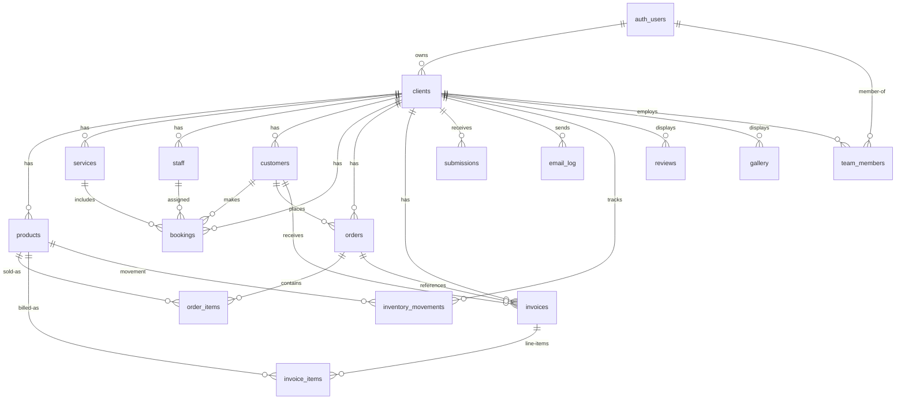

# My Grafix Worker — Complete Supabase Database Schema

> Generated by analyzing 100% of the Cloudflare Worker source code, frontend TypeScript types, and SQL fragments.

---

## 1. Database Overview

### Architecture

This is a **multi-tenant** SaaS platform (My Grafix Business OS) where each tenant is a business. Every tenant gets isolated data via `client_id` scoping. The system supports:

- **Barbershops** — booking flow, services, staff, reviews, gallery
- **Gyms** — memberships, bookings
- **Coffee shops** — ecommerce, products, orders
- **General businesses** — contact forms, invoices, customers

### Multi-Tenancy

Multi-tenancy is implemented via **row-level security (RLS)** and **application-level filtering**. Every single data table includes a `client_id TEXT NOT NULL` column. The Worker resolves the tenant from:

1. **JWT authentication** — the `sub` claim (auth user UUID) is looked up in `clients.auth_user_id` or `team_members.auth_user_id`
2. **Public endpoints** — `?clientId=` query param (for form submissions, public site data, booking creation, order creation)
3. **Claim flow** — new users sign up via Supabase Auth, then POST `/api/claim-account` to link their `auth_user_id` to a `client_id`

### How client_id Is Used

Every `GET/POST/PUT/DELETE` on `/api/dashboard/:resource` appends `client_id=eq.{clientId}` to the PostgREST query. This ensures a logged-in user for Business A can never see Business B's data. Public endpoints also scope by `client_id`.

### Authentication

- **Frontend** uses `@supabase/supabase-js` with Supabase Auth for Google OAuth and email/password
- **Worker** verifies the JWT using `SUPABASE_JWT_SECRET` (HS256) and extracts the `sub` (auth user UUID)
- The Worker resolves `auth_user_id → client_id` by checking `clients` then `team_members`
- `service_role` key is used for all internal Supabase queries (bypasses RLS from the Worker's perspective, but RLS is still applied if accessed directly)

### Tenant-Specific Tables

All of the following tables are scoped by `client_id`:
- `products`, `services`, `staff`, `customers`, `bookings`, `orders`, `order_items`, `invoices`, `invoice_items`, `submissions`, `email_log`, `inventory_movements`, `reviews`, `gallery`, `team_members`

The `clients` table itself is the tenant registry.

---

## 2. ER Diagram



---

## 3. Tables

### 3.1 `clients` — Tenant/Business Registry

**Purpose:** Each row is a business tenant. Stores business profile, branding, bank details, and links to Supabase Auth.

| Column | Type | Nullable | Default | Notes |
|--------|------|----------|---------|-------|
| `client_id` | `TEXT` | NOT NULL | — | Primary key, e.g. `CLI-A1B2C3` |
| `auth_user_id` | `TEXT` | YES | `NULL` | Supabase Auth `auth.users.id`, set on claim |
| `business_name` | `TEXT` | NOT NULL | — | Display name |
| `owner_email` | `TEXT` | NOT NULL | — | Email for notifications |
| `reply_email` | `TEXT` | YES | `NULL` | Reply-to for customer emails |
| `active` | `BOOLEAN` | NOT NULL | `true` | Is the account active |
| `logo_url` | `TEXT` | YES | `NULL` | R2 public URL for logo |
| `primary_color` | `TEXT` | YES | `'#111111'` | Branding hex color |
| `secondary_color` | `TEXT` | YES | `'#f5f5f5'` | Branding hex color |
| `hero_title` | `TEXT` | YES | `''` | Public site hero heading |
| `hero_subtitle` | `TEXT` | YES | `''` | Public site hero subheading |
| `phone` | `TEXT` | YES | `''` | Business phone number |
| `address` | `TEXT` | YES | `''` | Business address |
| `opening_hours` | `TEXT` | YES | `''` | Operating hours string |
| `business_type` | `TEXT` | YES | `'general'` | E.g. barbershop, gym, cafe, agency |
| `claim_code` | `TEXT` | YES | `NULL` | Unique code for manual relink |
| `bank_name` | `TEXT` | YES | `NULL` | Banking details for PDF invoices |
| `bank_account_name` | `TEXT` | YES | `NULL` | Banking details for PDF invoices |
| `bank_account_number` | `TEXT` | YES | `NULL` | Banking details for PDF invoices |
| `bank_branch_code` | `TEXT` | YES | `NULL` | Banking details for PDF invoices |
| `payment_instructions` | `TEXT` | YES | `NULL` | Free-text payment instructions for PDF |
| `created_at` | `TIMESTAMPTZ` | NOT NULL | `now()` | Row creation timestamp |

**Primary Key:** `client_id`
**Foreign Keys:** `auth_user_id` → `auth.users.id` (Supabase internal)
**Unique:** `auth_user_id` (should be unique — one user owns one client), `claim_code`
**Indexes:** `idx_clients_auth_user_id`, `idx_clients_owner_email`, `idx_clients_claim_code`

**Example row:**
```json
{
  "client_id": "CLI-A1B2C3",
  "auth_user_id": "550e8400-e29b-41d4-a716-446655440000",
  "business_name": "Luxury Barbershop",
  "owner_email": "owner@barbershop.com",
  "reply_email": "bookings@barbershop.com",
  "active": true,
  "logo_url": "https://r2.example.com/clients/CLI-A1B2C3/logos/logo.png",
  "primary_color": "#1a1a2e",
  "secondary_color": "#e2b616",
  "hero_title": "Premium Grooming",
  "hero_subtitle": "Where Style Meets Precision",
  "phone": "+27123456789",
  "address": "123 Main St, Cape Town",
  "opening_hours": "Mon-Sat 8am-6pm",
  "business_type": "barbershop",
  "claim_code": "XQBZ4821",
  "bank_name": "First National Bank",
  "bank_account_name": "Luxury Barbershop Pty Ltd",
  "bank_account_number": "62819283746",
  "bank_branch_code": "255005",
  "payment_instructions": "Please use invoice number as reference",
  "created_at": "2026-01-15T10:00:00Z"
}
```

---

### 3.2 `products` — Ecommerce & Inventory Items

**Purpose:** Products sold via the online storefront, managed in dashboard inventory.

| Column | Type | Nullable | Default | Notes |
|--------|------|----------|---------|-------|
| `id` | `UUID` | NOT NULL | `gen_random_uuid()` | Primary key |
| `client_id` | `TEXT` | NOT NULL | — | FK → `clients.client_id` |
| `name` | `TEXT` | NOT NULL | — | Product name |
| `sku` | `TEXT` | NOT NULL | — | Stock keeping unit |
| `category` | `TEXT` | NOT NULL | — | E.g. "Styling", "Beard Care" |
| `price` | `NUMERIC(10,2)` | NOT NULL | — | Retail price |
| `cost_price` | `NUMERIC(10,2)` | NOT NULL | `0` | Unit cost |
| `stock_qty` | `INTEGER` | NOT NULL | `0` | Current stock count |
| `low_stock_warning` | `INTEGER` | NOT NULL | `5` | Threshold for low-stock alert |
| `image_url` | `TEXT` | YES | `NULL` | R2 public URL for product image |
| `barcode` | `TEXT` | YES | `NULL` | EAN/barcode |
| `variants` | `JSONB` | YES | `'[]'` | Array of variant strings |
| `is_hidden` | `BOOLEAN` | NOT NULL | `false` | Hide from public storefront |
| `created_at` | `TIMESTAMPTZ` | NOT NULL | `now()` | Row creation timestamp |

**Primary Key:** `id`
**Foreign Keys:** `client_id` → `clients(client_id)` ON DELETE CASCADE
**Unique:** `(client_id, sku)` — SKU is unique per tenant

**Example row:**
```json
{
  "id": "a1b2c3d4-...",
  "client_id": "CLI-A1B2C3",
  "name": "Classic Hair Clay Wax",
  "sku": "POM-SL-01",
  "category": "Styling",
  "price": 24.99,
  "cost_price": 8.50,
  "stock_qty": 45,
  "low_stock_warning": 10,
  "image_url": "https://r2.example.com/clients/CLI-A1B2C3/products/wax.png",
  "barcode": "501234567890",
  "variants": ["Small", "Medium", "Large"],
  "is_hidden": false,
  "created_at": "2026-01-15T10:00:00Z"
}
```

---

### 3.3 `services` — Bookable Services

**Purpose:** Services offered by the business (e.g. haircuts, massages) used in the booking flow.

| Column | Type | Nullable | Default | Notes |
|--------|------|----------|---------|-------|
| `id` | `UUID` | NOT NULL | `gen_random_uuid()` | Primary key |
| `client_id` | `TEXT` | NOT NULL | — | FK → `clients.client_id` |
| `name` | `TEXT` | NOT NULL | — | Service name |
| `duration_minutes` | `INTEGER` | NOT NULL | — | Duration in minutes |
| `price` | `NUMERIC(10,2)` | NOT NULL | — | Service price |
| `active` | `BOOLEAN` | NOT NULL | `true` | Is available for booking |
| `created_at` | `TIMESTAMPTZ` | NOT NULL | `now()` | Row creation timestamp |

**Primary Key:** `id`
**Foreign Keys:** `client_id` → `clients(client_id)` ON DELETE CASCADE

**Example row:**
```json
{
  "id": "b2c3d4e5-...",
  "client_id": "CLI-A1B2C3",
  "name": "Premium Haircut",
  "duration_minutes": 45,
  "price": 35.00,
  "active": true,
  "created_at": "2026-01-15T10:00:00Z"
}
```

---

### 3.4 `staff` — Staff/Employees

**Purpose:** Staff members who perform services. Used for booking assignments and public site display.

| Column | Type | Nullable | Default | Notes |
|--------|------|----------|---------|-------|
| `id` | `UUID` | NOT NULL | `gen_random_uuid()` | Primary key |
| `client_id` | `TEXT` | NOT NULL | — | FK → `clients.client_id` |
| `name` | `TEXT` | NOT NULL | — | Display name |
| `full_name` | `TEXT` | YES | `NULL` | Full legal name |
| `role` | `TEXT` | YES | `NULL` | Job title (e.g. "Master Barber") |
| `active` | `BOOLEAN` | NOT NULL | `true` | Is currently employed |
| `created_at` | `TIMESTAMPTZ` | NOT NULL | `now()` | Row creation timestamp |

**Primary Key:** `id`
**Foreign Keys:** `client_id` → `clients(client_id)` ON DELETE CASCADE

**Example row:**
```json
{
  "id": "c3d4e5f6-...",
  "client_id": "CLI-A1B2C3",
  "name": "James Wilson",
  "full_name": "James Wilson",
  "role": "Master Barber",
  "active": true,
  "created_at": "2026-01-15T10:00:00Z"
}
```

---

### 3.5 `customers` — Customer Records

**Purpose:** Customers who book, order, or receive invoices. Created automatically on first interaction.

| Column | Type | Nullable | Default | Notes |
|--------|------|----------|---------|-------|
| `id` | `UUID` | NOT NULL | `gen_random_uuid()` | Primary key |
| `client_id` | `TEXT` | NOT NULL | — | FK → `clients.client_id` |
| `name` | `TEXT` | NOT NULL | — | Customer name |
| `email` | `TEXT` | YES | `NULL` | Email address (used for find-or-create) |
| `phone` | `TEXT` | YES | `NULL` | Phone number |
| `notes` | `TEXT` | YES | `NULL` | Internal notes |
| `tags` | `JSONB` | YES | `'[]'` | Tags for segmentation |
| `created_at` | `TIMESTAMPTZ` | NOT NULL | `now()` | Row creation timestamp |

**Primary Key:** `id`
**Foreign Keys:** `client_id` → `clients(client_id)` ON DELETE CASCADE
**Unique:** `(client_id, email)` — email is unique per tenant

**Example row:**
```json
{
  "id": "d4e5f6a7-...",
  "client_id": "CLI-A1B2C3",
  "name": "Alexander Sterling",
  "email": "alex@example.com",
  "phone": "+27831234567",
  "notes": "VIP client",
  "tags": ["vip", "returning"],
  "created_at": "2026-01-20T14:30:00Z"
}
```

---

### 3.6 `bookings` — Appointments/Reservations

**Purpose:** Customer appointments for services with staff.

| Column | Type | Nullable | Default | Notes |
|--------|------|----------|---------|-------|
| `id` | `UUID` | NOT NULL | `gen_random_uuid()` | Primary key |
| `client_id` | `TEXT` | NOT NULL | — | FK → `clients.client_id` |
| `customer_id` | `UUID` | NOT NULL | — | FK → `customers.id` |
| `service_id` | `UUID` | NOT NULL | — | FK → `services.id` |
| `staff_id` | `UUID` | YES | `NULL` | FK → `staff.id` |
| `start_time` | `TIMESTAMPTZ` | NOT NULL | — | Appointment start |
| `end_time` | `TIMESTAMPTZ` | NOT NULL | — | Calculated from start + service duration |
| `status` | `TEXT` | NOT NULL | `'confirmed'` | One of: confirmed, upcoming, completed, cancelled, no-show |
| `created_at` | `TIMESTAMPTZ` | NOT NULL | `now()` | Row creation timestamp |

**Primary Key:** `id`
**Foreign Keys:**
- `client_id` → `clients(client_id)` ON DELETE CASCADE
- `customer_id` → `customers(id)` ON DELETE CASCADE
- `service_id` → `services(id)` ON DELETE CASCADE
- `staff_id` → `staff(id)` ON DELETE SET NULL

**Indexes:** `idx_bookings_staff_time` on `(staff_id, start_time)` for availability lookups

**Example row:**
```json
{
  "id": "e5f6a7b8-...",
  "client_id": "CLI-A1B2C3",
  "customer_id": "d4e5f6a7-...",
  "service_id": "b2c3d4e5-...",
  "staff_id": "c3d4e5f6-...",
  "start_time": "2026-02-01T10:00:00Z",
  "end_time": "2026-02-01T10:45:00Z",
  "status": "confirmed",
  "created_at": "2026-01-25T08:00:00Z"
}
```

---

### 3.7 `orders` — Sales Orders

**Purpose:** Ecommerce checkout orders with line items.

| Column | Type | Nullable | Default | Notes |
|--------|------|----------|---------|-------|
| `id` | `UUID` | NOT NULL | `gen_random_uuid()` | Primary key |
| `client_id` | `TEXT` | NOT NULL | — | FK → `clients.client_id` |
| `customer_id` | `UUID` | NOT NULL | — | FK → `customers.id` |
| `order_number` | `TEXT` | NOT NULL | — | Human-readable reference, e.g. "ORD-A1B2C3" |
| `status` | `TEXT` | NOT NULL | `'pending'` | One of: pending, new, paid, cancelled, refunded |
| `subtotal` | `NUMERIC(10,2)` | NOT NULL | `0` | Sum of line items |
| `tax` | `NUMERIC(10,2)` | NOT NULL | `0` | Tax amount |
| `total` | `NUMERIC(10,2)` | NOT NULL | `0` | Grand total |
| `notes` | `TEXT` | YES | `NULL` | Order notes |
| `created_at` | `TIMESTAMPTZ` | NOT NULL | `now()` | Row creation timestamp |

**Primary Key:** `id`
**Foreign Keys:**
- `client_id` → `clients(client_id)` ON DELETE CASCADE
- `customer_id` → `customers(id)` ON DELETE CASCADE
**Unique:** `order_number`

**Example row:**
```json
{
  "id": "f6a7b8c9-...",
  "client_id": "CLI-A1B2C3",
  "customer_id": "d4e5f6a7-...",
  "order_number": "ORD-X9Y8Z7",
  "status": "pending",
  "subtotal": 74.97,
  "tax": 0,
  "total": 74.97,
  "notes": "Leave at the door",
  "created_at": "2026-02-01T15:00:00Z"
}
```

---

### 3.8 `order_items` — Order Line Items

**Purpose:** Individual items within an order. Stores a name snapshot for historical accuracy.

| Column | Type | Nullable | Default | Notes |
|--------|------|----------|---------|-------|
| `id` | `UUID` | NOT NULL | `gen_random_uuid()` | Primary key |
| `order_id` | `UUID` | NOT NULL | — | FK → `orders.id` |
| `product_id` | `UUID` | NOT NULL | — | FK → `products.id` |
| `name_snapshot` | `TEXT` | NOT NULL | — | Product name at time of order |
| `unit_price` | `NUMERIC(10,2)` | NOT NULL | — | Price per unit |
| `qty` | `INTEGER` | NOT NULL | — | Quantity ordered |
| `line_total` | `NUMERIC(10,2)` | NOT NULL | — | `unit_price * qty` |
| `created_at` | `TIMESTAMPTZ` | NOT NULL | `now()` | Row creation timestamp |

**Primary Key:** `id`
**Foreign Keys:**
- `order_id` → `orders(id)` ON DELETE CASCADE
- `product_id` → `products(id)` ON DELETE CASCADE

---

### 3.9 `invoices` — Billing Invoices

**Purpose:** Professional invoices with PDF generation and email sending.

| Column | Type | Nullable | Default | Notes |
|--------|------|----------|---------|-------|
| `id` | `UUID` | NOT NULL | `gen_random_uuid()` | Primary key |
| `client_id` | `TEXT` | NOT NULL | — | FK → `clients.client_id` |
| `customer_id` | `UUID` | NOT NULL | — | FK → `customers.id` |
| `order_id` | `UUID` | YES | `NULL` | FK → `orders.id` |
| `invoice_number` | `TEXT` | NOT NULL | — | Human-readable reference, e.g. "INV-A1B2C3" |
| `status` | `TEXT` | NOT NULL | `'draft'` | One of: draft, sent, paid, pending, cancelled, overdue |
| `subtotal` | `NUMERIC(10,2)` | NOT NULL | `0` | Before tax |
| `tax` | `NUMERIC(10,2)` | NOT NULL | `0` | Tax amount |
| `total` | `NUMERIC(10,2)` | NOT NULL | `0` | Grand total |
| `issued_at` | `TIMESTAMPTZ` | YES | `now()` | Date of issue |
| `due_at` | `TIMESTAMPTZ` | YES | `NULL` | Payment due date |
| `pdf_url` | `TEXT` | YES | `NULL` | R2 public URL for generated PDF |
| `created_at` | `TIMESTAMPTZ` | NOT NULL | `now()` | Row creation timestamp |

**Primary Key:** `id`
**Foreign Keys:**
- `client_id` → `clients(client_id)` ON DELETE CASCADE
- `customer_id` → `customers(id)` ON DELETE CASCADE
- `order_id` → `orders(id)` ON DELETE SET NULL
**Unique:** `invoice_number`

---

### 3.10 `invoice_items` — Invoice Line Items

**Purpose:** Line items on an invoice.

| Column | Type | Nullable | Default | Notes |
|--------|------|----------|---------|-------|
| `id` | `UUID` | NOT NULL | `gen_random_uuid()` | Primary key |
| `invoice_id` | `UUID` | NOT NULL | — | FK → `invoices.id` |
| `product_id` | `UUID` | YES | `NULL` | FK → `products.id` (optional) |
| `description` | `TEXT` | NOT NULL | — | Item description |
| `quantity` | `INTEGER` | NOT NULL | — | Quantity |
| `unit_price` | `NUMERIC(10,2)` | NOT NULL | — | Price per unit |
| `line_total` | `NUMERIC(10,2)` | NOT NULL | — | `quantity * unit_price` |
| `created_at` | `TIMESTAMPTZ` | NOT NULL | `now()` | Row creation timestamp |

**Primary Key:** `id`
**Foreign Keys:**
- `invoice_id` → `invoices(id)` ON DELETE CASCADE
- `product_id` → `products(id)` ON DELETE SET NULL

---

### 3.11 `submissions` — Form Submissions

**Purpose:** Contact/quote/booking/reservation form submissions from public websites.

| Column | Type | Nullable | Default | Notes |
|--------|------|----------|---------|-------|
| `submission_id` | `TEXT` | NOT NULL | — | Primary key, e.g. "SUB-A1B2C3" |
| `client_id` | `TEXT` | NOT NULL | — | FK → `clients.client_id` |
| `form_name` | `TEXT` | NOT NULL | — | E.g. "contact", "quote", "booking", "reservation" |
| `customer_name` | `TEXT` | NOT NULL | — | Submitter's name |
| `customer_email` | `TEXT` | NOT NULL | — | Submitter's email |
| `submission_json` | `JSONB` | NOT NULL | `'{}'` | Arbitrary form field data |
| `status` | `TEXT` | NOT NULL | `'received'` | One of: received, new, replied, archived, pending, confirmed, cancelled, completed |
| `ip_address` | `TEXT` | YES | `NULL` | Submitter IP address |
| `user_agent` | `TEXT` | YES | `NULL` | Submitter browser user agent |
| `customer_email_id` | `TEXT` | YES | `NULL` | Resend message ID for customer email |
| `owner_email_id` | `TEXT` | YES | `NULL` | Resend message ID for owner email |
| `created_at` | `TIMESTAMPTZ` | NOT NULL | `now()` | Row creation timestamp |

**Primary Key:** `submission_id`
**Foreign Keys:** `client_id` → `clients(client_id)` ON DELETE CASCADE

---

### 3.12 `email_log` — Email Audit Trail

**Purpose:** Records every email sent via Resend for audit and debugging.

| Column | Type | Nullable | Default | Notes |
|--------|------|----------|---------|-------|
| `id` | `UUID` | NOT NULL | `gen_random_uuid()` | Primary key |
| `client_id` | `TEXT` | NOT NULL | — | FK → `clients.client_id` |
| `related_type` | `TEXT` | NOT NULL | — | One of: submission, order, booking, invoice |
| `related_id` | `UUID` | YES | `NULL` | ID of the related record |
| `recipient` | `TEXT` | NOT NULL | — | Email address |
| `subject` | `TEXT` | NOT NULL | — | Email subject line |
| `resend_id` | `TEXT` | YES | `NULL` | Resend API message ID |
| `created_at` | `TIMESTAMPTZ` | NOT NULL | `now()` | Row creation timestamp |

**Primary Key:** `id`
**Foreign Keys:** `client_id` → `clients(client_id)` ON DELETE CASCADE
**Indexes:** `idx_email_log_client_related` on `(client_id, related_type, related_id)`

---

### 3.13 `team_members` — Team/Staff Auth Linking

**Purpose:** Links additional auth users to a client (admin/staff roles). Used for multi-user dashboard access.

| Column | Type | Nullable | Default | Notes |
|--------|------|----------|---------|-------|
| `id` | `UUID` | NOT NULL | `gen_random_uuid()` | Primary key |
| `client_id` | `TEXT` | NOT NULL | — | FK → `clients.client_id` |
| `auth_user_id` | `TEXT` | NOT NULL | — | FK → `auth.users.id` |
| `name` | `TEXT` | NOT NULL | — | Display name |
| `email` | `TEXT` | NOT NULL | — | Email address |
| `role` | `TEXT` | NOT NULL | — | One of: owner, admin, staff |
| `active` | `BOOLEAN` | NOT NULL | `true` | Is active |
| `created_at` | `TIMESTAMPTZ` | NOT NULL | `now()` | Row creation timestamp |

**Primary Key:** `id`
**Foreign Keys:**
- `client_id` → `clients(client_id)` ON DELETE CASCADE
- `auth_user_id` → `auth.users.id` (Supabase internal)
**Unique:** `(client_id, auth_user_id)`, `(client_id, email)`

---

### 3.14 `inventory_movements` — Stock Movement Audit

**Purpose:** Records every stock change for audit trail.

| Column | Type | Nullable | Default | Notes |
|--------|------|----------|---------|-------|
| `id` | `UUID` | NOT NULL | `gen_random_uuid()` | Primary key |
| `client_id` | `TEXT` | NOT NULL | — | FK → `clients.client_id` |
| `product_id` | `UUID` | NOT NULL | — | FK → `products.id` |
| `change_qty` | `INTEGER` | NOT NULL | — | Negative for sales, positive for restock |
| `reason` | `TEXT` | NOT NULL | — | E.g. "sale", "restock", "adjustment" |
| `note` | `TEXT` | YES | `NULL` | Additional context |
| `created_at` | `TIMESTAMPTZ` | NOT NULL | `now()` | Row creation timestamp |

**Primary Key:** `id`
**Foreign Keys:**
- `client_id` → `clients(client_id)` ON DELETE CASCADE
- `product_id` → `products(id)` ON DELETE CASCADE

---

### 3.15 `reviews` — Customer Reviews (Barbershop)

**Purpose:** Customer testimonials displayed on the public site.

| Column | Type | Nullable | Default | Notes |
|--------|------|----------|---------|-------|
| `id` | `UUID` | NOT NULL | `gen_random_uuid()` | Primary key |
| `client_id` | `TEXT` | NOT NULL | — | FK → `clients.client_id` |
| `name` | `TEXT` | NOT NULL | — | Reviewer name |
| `rating` | `NUMERIC(2,1)` | NOT NULL | `5.0` | Rating out of 5 (e.g. 4.5) |
| `text` | `TEXT` | NOT NULL | — | Review content |
| `service` | `TEXT` | YES | `NULL` | Service name reviewed |
| `avatar` | `TEXT` | YES | `NULL` | Avatar image URL |
| `created_at` | `TIMESTAMPTZ` | NOT NULL | `now()` | Row creation timestamp |

**Primary Key:** `id`
**Foreign Keys:** `client_id` → `clients(client_id)` ON DELETE CASCADE

---

### 3.16 `gallery` — Before/After Gallery (Barbershop)

**Purpose:** Before-and-after image pairs for the public site gallery slider.

| Column | Type | Nullable | Default | Notes |
|--------|------|----------|---------|-------|
| `id` | `UUID` | NOT NULL | `gen_random_uuid()` | Primary key |
| `client_id` | `TEXT` | NOT NULL | — | FK → `clients.client_id` |
| `title` | `TEXT` | YES | `NULL` | Gallery item title |
| `before_url` | `TEXT` | YES | `NULL` | Before image URL |
| `after_url` | `TEXT` | YES | `NULL` | After image URL |
| `barber_name` | `TEXT` | YES | `NULL` | Barber who did the work |
| `created_at` | `TIMESTAMPTZ` | NOT NULL | `now()` | Row creation timestamp |

**Primary Key:** `id`
**Foreign Keys:** `client_id` → `clients(client_id)` ON DELETE CASCADE

---

## 4. SQL — CREATE TABLE Statements

```sql
-- ==================================================
-- EXTENSIONS
-- ==================================================
CREATE EXTENSION IF NOT EXISTS "pgcrypto";
CREATE EXTENSION IF NOT EXISTS "uuid-ossp";

-- ==================================================
-- ENUMS
-- ==================================================
-- Note: Using TEXT columns with CHECK constraints for flexibility

-- ==================================================
-- CLIENTS (Tenant Registry)
-- ==================================================
CREATE TABLE public.clients (
    client_id TEXT NOT NULL,
    auth_user_id TEXT NULL,
    business_name TEXT NOT NULL,
    owner_email TEXT NOT NULL,
    reply_email TEXT NULL,
    active BOOLEAN NOT NULL DEFAULT true,
    logo_url TEXT NULL,
    primary_color TEXT NULL DEFAULT '#111111',
    secondary_color TEXT NULL DEFAULT '#f5f5f5',
    hero_title TEXT NULL DEFAULT '',
    hero_subtitle TEXT NULL DEFAULT '',
    phone TEXT NULL DEFAULT '',
    address TEXT NULL DEFAULT '',
    opening_hours TEXT NULL DEFAULT '',
    business_type TEXT NULL DEFAULT 'general',
    claim_code TEXT NULL,
    bank_name TEXT NULL,
    bank_account_name TEXT NULL,
    bank_account_number TEXT NULL,
    bank_branch_code TEXT NULL,
    payment_instructions TEXT NULL,
    created_at TIMESTAMPTZ NOT NULL DEFAULT now(),
    CONSTRAINT clients_pkey PRIMARY KEY (client_id),
    CONSTRAINT clients_auth_user_id_key UNIQUE (auth_user_id),
    CONSTRAINT clients_claim_code_key UNIQUE (claim_code),
    CONSTRAINT clients_owner_email_check CHECK (owner_email ~* '^[^\s@]+@[^\s@]+\.[^\s@]+$')
);

-- ==================================================
-- PRODUCTS
-- ==================================================
CREATE TABLE public.products (
    id UUID NOT NULL DEFAULT gen_random_uuid(),
    client_id TEXT NOT NULL,
    name TEXT NOT NULL,
    sku TEXT NOT NULL,
    category TEXT NOT NULL DEFAULT 'General',
    price NUMERIC(10,2) NOT NULL DEFAULT 0,
    cost_price NUMERIC(10,2) NOT NULL DEFAULT 0,
    stock_qty INTEGER NOT NULL DEFAULT 0,
    low_stock_warning INTEGER NOT NULL DEFAULT 5,
    image_url TEXT NULL,
    barcode TEXT NULL,
    variants JSONB NULL DEFAULT '[]'::jsonb,
    is_hidden BOOLEAN NOT NULL DEFAULT false,
    created_at TIMESTAMPTZ NOT NULL DEFAULT now(),
    CONSTRAINT products_pkey PRIMARY KEY (id),
    CONSTRAINT products_client_id_fkey FOREIGN KEY (client_id) REFERENCES public.clients(client_id) ON DELETE CASCADE,
    CONSTRAINT products_client_id_sku_key UNIQUE (client_id, sku),
    CONSTRAINT products_price_check CHECK (price >= 0),
    CONSTRAINT products_stock_qty_check CHECK (stock_qty >= 0)
);

-- ==================================================
-- SERVICES
-- ==================================================
CREATE TABLE public.services (
    id UUID NOT NULL DEFAULT gen_random_uuid(),
    client_id TEXT NOT NULL,
    name TEXT NOT NULL,
    duration_minutes INTEGER NOT NULL,
    price NUMERIC(10,2) NOT NULL DEFAULT 0,
    active BOOLEAN NOT NULL DEFAULT true,
    created_at TIMESTAMPTZ NOT NULL DEFAULT now(),
    CONSTRAINT services_pkey PRIMARY KEY (id),
    CONSTRAINT services_client_id_fkey FOREIGN KEY (client_id) REFERENCES public.clients(client_id) ON DELETE CASCADE,
    CONSTRAINT services_duration_check CHECK (duration_minutes > 0),
    CONSTRAINT services_price_check CHECK (price >= 0)
);

-- ==================================================
-- STAFF
-- ==================================================
CREATE TABLE public.staff (
    id UUID NOT NULL DEFAULT gen_random_uuid(),
    client_id TEXT NOT NULL,
    name TEXT NOT NULL,
    full_name TEXT NULL,
    role TEXT NULL,
    active BOOLEAN NOT NULL DEFAULT true,
    created_at TIMESTAMPTZ NOT NULL DEFAULT now(),
    CONSTRAINT staff_pkey PRIMARY KEY (id),
    CONSTRAINT staff_client_id_fkey FOREIGN KEY (client_id) REFERENCES public.clients(client_id) ON DELETE CASCADE
);

-- ==================================================
-- CUSTOMERS
-- ==================================================
CREATE TABLE public.customers (
    id UUID NOT NULL DEFAULT gen_random_uuid(),
    client_id TEXT NOT NULL,
    name TEXT NOT NULL,
    email TEXT NULL,
    phone TEXT NULL,
    notes TEXT NULL,
    tags JSONB NULL DEFAULT '[]'::jsonb,
    created_at TIMESTAMPTZ NOT NULL DEFAULT now(),
    CONSTRAINT customers_pkey PRIMARY KEY (id),
    CONSTRAINT customers_client_id_fkey FOREIGN KEY (client_id) REFERENCES public.clients(client_id) ON DELETE CASCADE,
    CONSTRAINT customers_client_id_email_key UNIQUE (client_id, email)
);

-- ==================================================
-- BOOKINGS
-- ==================================================
CREATE TABLE public.bookings (
    id UUID NOT NULL DEFAULT gen_random_uuid(),
    client_id TEXT NOT NULL,
    customer_id UUID NOT NULL,
    service_id UUID NOT NULL,
    staff_id UUID NULL,
    start_time TIMESTAMPTZ NOT NULL,
    end_time TIMESTAMPTZ NOT NULL,
    status TEXT NOT NULL DEFAULT 'confirmed',
    created_at TIMESTAMPTZ NOT NULL DEFAULT now(),
    CONSTRAINT bookings_pkey PRIMARY KEY (id),
    CONSTRAINT bookings_client_id_fkey FOREIGN KEY (client_id) REFERENCES public.clients(client_id) ON DELETE CASCADE,
    CONSTRAINT bookings_customer_id_fkey FOREIGN KEY (customer_id) REFERENCES public.customers(id) ON DELETE CASCADE,
    CONSTRAINT bookings_service_id_fkey FOREIGN KEY (service_id) REFERENCES public.services(id) ON DELETE CASCADE,
    CONSTRAINT bookings_staff_id_fkey FOREIGN KEY (staff_id) REFERENCES public.staff(id) ON DELETE SET NULL,
    CONSTRAINT bookings_status_check CHECK (status IN ('confirmed', 'upcoming', 'completed', 'cancelled', 'no-show')),
    CONSTRAINT bookings_time_check CHECK (end_time > start_time)
);

-- ==================================================
-- ORDERS
-- ==================================================
CREATE TABLE public.orders (
    id UUID NOT NULL DEFAULT gen_random_uuid(),
    client_id TEXT NOT NULL,
    customer_id UUID NOT NULL,
    order_number TEXT NOT NULL,
    status TEXT NOT NULL DEFAULT 'pending',
    subtotal NUMERIC(10,2) NOT NULL DEFAULT 0,
    tax NUMERIC(10,2) NOT NULL DEFAULT 0,
    total NUMERIC(10,2) NOT NULL DEFAULT 0,
    notes TEXT NULL,
    created_at TIMESTAMPTZ NOT NULL DEFAULT now(),
    CONSTRAINT orders_pkey PRIMARY KEY (id),
    CONSTRAINT orders_client_id_fkey FOREIGN KEY (client_id) REFERENCES public.clients(client_id) ON DELETE CASCADE,
    CONSTRAINT orders_customer_id_fkey FOREIGN KEY (customer_id) REFERENCES public.customers(id) ON DELETE CASCADE,
    CONSTRAINT orders_order_number_key UNIQUE (order_number),
    CONSTRAINT orders_status_check CHECK (status IN ('pending', 'new', 'paid', 'cancelled', 'refunded')),
    CONSTRAINT orders_total_check CHECK (total >= 0)
);

-- ==================================================
-- ORDER ITEMS
-- ==================================================
CREATE TABLE public.order_items (
    id UUID NOT NULL DEFAULT gen_random_uuid(),
    order_id UUID NOT NULL,
    product_id UUID NOT NULL,
    name_snapshot TEXT NOT NULL,
    unit_price NUMERIC(10,2) NOT NULL DEFAULT 0,
    qty INTEGER NOT NULL DEFAULT 1,
    line_total NUMERIC(10,2) NOT NULL DEFAULT 0,
    created_at TIMESTAMPTZ NOT NULL DEFAULT now(),
    CONSTRAINT order_items_pkey PRIMARY KEY (id),
    CONSTRAINT order_items_order_id_fkey FOREIGN KEY (order_id) REFERENCES public.orders(id) ON DELETE CASCADE,
    CONSTRAINT order_items_product_id_fkey FOREIGN KEY (product_id) REFERENCES public.products(id) ON DELETE CASCADE,
    CONSTRAINT order_items_qty_check CHECK (qty > 0)
);

-- ==================================================
-- INVOICES
-- ==================================================
CREATE TABLE public.invoices (
    id UUID NOT NULL DEFAULT gen_random_uuid(),
    client_id TEXT NOT NULL,
    customer_id UUID NOT NULL,
    order_id UUID NULL,
    invoice_number TEXT NOT NULL,
    status TEXT NOT NULL DEFAULT 'draft',
    subtotal NUMERIC(10,2) NOT NULL DEFAULT 0,
    tax NUMERIC(10,2) NOT NULL DEFAULT 0,
    total NUMERIC(10,2) NOT NULL DEFAULT 0,
    issued_at TIMESTAMPTZ NULL DEFAULT now(),
    due_at TIMESTAMPTZ NULL,
    pdf_url TEXT NULL,
    created_at TIMESTAMPTZ NOT NULL DEFAULT now(),
    CONSTRAINT invoices_pkey PRIMARY KEY (id),
    CONSTRAINT invoices_client_id_fkey FOREIGN KEY (client_id) REFERENCES public.clients(client_id) ON DELETE CASCADE,
    CONSTRAINT invoices_customer_id_fkey FOREIGN KEY (customer_id) REFERENCES public.customers(id) ON DELETE CASCADE,
    CONSTRAINT invoices_order_id_fkey FOREIGN KEY (order_id) REFERENCES public.orders(id) ON DELETE SET NULL,
    CONSTRAINT invoices_invoice_number_key UNIQUE (invoice_number),
    CONSTRAINT invoices_status_check CHECK (status IN ('draft', 'sent', 'paid', 'pending', 'cancelled', 'overdue')),
    CONSTRAINT invoices_total_check CHECK (total >= 0)
);

-- ==================================================
-- INVOICE ITEMS
-- ==================================================
CREATE TABLE public.invoice_items (
    id UUID NOT NULL DEFAULT gen_random_uuid(),
    invoice_id UUID NOT NULL,
    product_id UUID NULL,
    description TEXT NOT NULL,
    quantity INTEGER NOT NULL DEFAULT 1,
    unit_price NUMERIC(10,2) NOT NULL DEFAULT 0,
    line_total NUMERIC(10,2) NOT NULL DEFAULT 0,
    created_at TIMESTAMPTZ NOT NULL DEFAULT now(),
    CONSTRAINT invoice_items_pkey PRIMARY KEY (id),
    CONSTRAINT invoice_items_invoice_id_fkey FOREIGN KEY (invoice_id) REFERENCES public.invoices(id) ON DELETE CASCADE,
    CONSTRAINT invoice_items_product_id_fkey FOREIGN KEY (product_id) REFERENCES public.products(id) ON DELETE SET NULL,
    CONSTRAINT invoice_items_quantity_check CHECK (quantity > 0)
);

-- ==================================================
-- SUBMISSIONS (Form Submissions)
-- ==================================================
CREATE TABLE public.submissions (
    submission_id TEXT NOT NULL,
    client_id TEXT NOT NULL,
    form_name TEXT NOT NULL,
    customer_name TEXT NOT NULL,
    customer_email TEXT NOT NULL,
    submission_json JSONB NOT NULL DEFAULT '{}'::jsonb,
    status TEXT NOT NULL DEFAULT 'received',
    ip_address TEXT NULL,
    user_agent TEXT NULL,
    customer_email_id TEXT NULL,
    owner_email_id TEXT NULL,
    created_at TIMESTAMPTZ NOT NULL DEFAULT now(),
    CONSTRAINT submissions_pkey PRIMARY KEY (submission_id),
    CONSTRAINT submissions_client_id_fkey FOREIGN KEY (client_id) REFERENCES public.clients(client_id) ON DELETE CASCADE,
    CONSTRAINT submissions_status_check CHECK (status IN ('received', 'new', 'replied', 'archived', 'pending', 'confirmed', 'cancelled', 'completed'))
);

-- ==================================================
-- EMAIL LOG
-- ==================================================
CREATE TABLE public.email_log (
    id UUID NOT NULL DEFAULT gen_random_uuid(),
    client_id TEXT NOT NULL,
    related_type TEXT NOT NULL,
    related_id UUID NULL,
    recipient TEXT NOT NULL,
    subject TEXT NOT NULL,
    resend_id TEXT NULL,
    created_at TIMESTAMPTZ NOT NULL DEFAULT now(),
    CONSTRAINT email_log_pkey PRIMARY KEY (id),
    CONSTRAINT email_log_client_id_fkey FOREIGN KEY (client_id) REFERENCES public.clients(client_id) ON DELETE CASCADE,
    CONSTRAINT email_log_related_type_check CHECK (related_type IN ('submission', 'order', 'booking', 'invoice'))
);

-- ==================================================
-- TEAM MEMBERS
-- ==================================================
CREATE TABLE public.team_members (
    id UUID NOT NULL DEFAULT gen_random_uuid(),
    client_id TEXT NOT NULL,
    auth_user_id TEXT NOT NULL,
    name TEXT NOT NULL,
    email TEXT NOT NULL,
    role TEXT NOT NULL DEFAULT 'staff',
    active BOOLEAN NOT NULL DEFAULT true,
    created_at TIMESTAMPTZ NOT NULL DEFAULT now(),
    CONSTRAINT team_members_pkey PRIMARY KEY (id),
    CONSTRAINT team_members_client_id_fkey FOREIGN KEY (client_id) REFERENCES public.clients(client_id) ON DELETE CASCADE,
    CONSTRAINT team_members_client_id_auth_user_id_key UNIQUE (client_id, auth_user_id),
    CONSTRAINT team_members_client_id_email_key UNIQUE (client_id, email),
    CONSTRAINT team_members_role_check CHECK (role IN ('owner', 'admin', 'staff'))
);

-- ==================================================
-- INVENTORY MOVEMENTS
-- ==================================================
CREATE TABLE public.inventory_movements (
    id UUID NOT NULL DEFAULT gen_random_uuid(),
    client_id TEXT NOT NULL,
    product_id UUID NOT NULL,
    change_qty INTEGER NOT NULL,
    reason TEXT NOT NULL,
    note TEXT NULL,
    created_at TIMESTAMPTZ NOT NULL DEFAULT now(),
    CONSTRAINT inventory_movements_pkey PRIMARY KEY (id),
    CONSTRAINT inventory_movements_client_id_fkey FOREIGN KEY (client_id) REFERENCES public.clients(client_id) ON DELETE CASCADE,
    CONSTRAINT inventory_movements_product_id_fkey FOREIGN KEY (product_id) REFERENCES public.products(id) ON DELETE CASCADE
);

-- ==================================================
-- REVIEWS (Barbershop)
-- ==================================================
CREATE TABLE public.reviews (
    id UUID NOT NULL DEFAULT gen_random_uuid(),
    client_id TEXT NOT NULL,
    name TEXT NOT NULL,
    rating NUMERIC(2,1) NOT NULL DEFAULT 5.0,
    text TEXT NOT NULL,
    service TEXT NULL,
    avatar TEXT NULL,
    created_at TIMESTAMPTZ NOT NULL DEFAULT now(),
    CONSTRAINT reviews_pkey PRIMARY KEY (id),
    CONSTRAINT reviews_client_id_fkey FOREIGN KEY (client_id) REFERENCES public.clients(client_id) ON DELETE CASCADE,
    CONSTRAINT reviews_rating_check CHECK (rating >= 0 AND rating <= 5)
);

-- ==================================================
-- GALLERY (Barbershop Before/After)
-- ==================================================
CREATE TABLE public.gallery (
    id UUID NOT NULL DEFAULT gen_random_uuid(),
    client_id TEXT NOT NULL,
    title TEXT NULL,
    before_url TEXT NULL,
    after_url TEXT NULL,
    barber_name TEXT NULL,
    created_at TIMESTAMPTZ NOT NULL DEFAULT now(),
    CONSTRAINT gallery_pkey PRIMARY KEY (id),
    CONSTRAINT gallery_client_id_fkey FOREIGN KEY (client_id) REFERENCES public.clients(client_id) ON DELETE CASCADE
);
```

---

## 5. Indexes

```sql
-- ==================================================
-- CLIENTS INDEXES
-- ==================================================
CREATE INDEX idx_clients_auth_user_id ON public.clients (auth_user_id) WHERE auth_user_id IS NOT NULL;
CREATE INDEX idx_clients_owner_email ON public.clients (owner_email);
CREATE INDEX idx_clients_claim_code ON public.clients (claim_code) WHERE claim_code IS NOT NULL;

-- ==================================================
-- PRODUCTS INDEXES
-- ==================================================
CREATE INDEX idx_products_client_id ON public.products (client_id);
CREATE INDEX idx_products_created_at ON public.products (created_at DESC);
CREATE INDEX idx_products_category ON public.products (client_id, category);
CREATE INDEX idx_products_stock_qty ON public.products (client_id, stock_qty);
CREATE INDEX idx_products_is_hidden ON public.products (client_id, is_hidden);
CREATE INDEX idx_products_name_search ON public.products USING gin (to_tsvector('english', name));

-- ==================================================
-- SERVICES INDEXES
-- ==================================================
CREATE INDEX idx_services_client_id ON public.services (client_id);
CREATE INDEX idx_services_active ON public.services (client_id, active);

-- ==================================================
-- STAFF INDEXES
-- ==================================================
CREATE INDEX idx_staff_client_id ON public.staff (client_id);
CREATE INDEX idx_staff_active ON public.staff (client_id, active);

-- ==================================================
-- CUSTOMERS INDEXES
-- ==================================================
CREATE INDEX idx_customers_client_id ON public.customers (client_id);
CREATE INDEX idx_customers_email ON public.customers (client_id, email);
CREATE INDEX idx_customers_created_at ON public.customers (created_at DESC);
CREATE INDEX idx_customers_name_search ON public.customers USING gin (to_tsvector('english', name));

-- ==================================================
-- BOOKINGS INDEXES
-- ==================================================
CREATE INDEX idx_bookings_client_id ON public.bookings (client_id);
CREATE INDEX idx_bookings_customer_id ON public.bookings (customer_id);
CREATE INDEX idx_bookings_service_id ON public.bookings (service_id);
CREATE INDEX idx_bookings_staff_id ON public.bookings (staff_id);
CREATE INDEX idx_bookings_start_time ON public.bookings (start_time);
CREATE INDEX idx_bookings_status ON public.bookings (client_id, status);
CREATE INDEX idx_bookings_staff_time ON public.bookings (staff_id, start_time);
CREATE INDEX idx_bookings_date_range ON public.bookings (client_id, start_time, end_time);

-- ==================================================
-- ORDERS INDEXES
-- ==================================================
CREATE INDEX idx_orders_client_id ON public.orders (client_id);
CREATE INDEX idx_orders_customer_id ON public.orders (customer_id);
CREATE INDEX idx_orders_created_at ON public.orders (created_at DESC);
CREATE INDEX idx_orders_status ON public.orders (client_id, status);
CREATE INDEX idx_orders_date ON public.orders (client_id, created_at);
CREATE INDEX idx_orders_order_number ON public.orders (order_number);

-- ==================================================
-- ORDER ITEMS INDEXES
-- ==================================================
CREATE INDEX idx_order_items_order_id ON public.order_items (order_id);
CREATE INDEX idx_order_items_product_id ON public.order_items (product_id);

-- ==================================================
-- INVOICES INDEXES
-- ==================================================
CREATE INDEX idx_invoices_client_id ON public.invoices (client_id);
CREATE INDEX idx_invoices_customer_id ON public.invoices (customer_id);
CREATE INDEX idx_invoices_order_id ON public.invoices (order_id);
CREATE INDEX idx_invoices_status ON public.invoices (client_id, status);
CREATE INDEX idx_invoices_created_at ON public.invoices (created_at DESC);
CREATE INDEX idx_invoices_issued_at ON public.invoices (issued_at DESC);
CREATE INDEX idx_invoices_invoice_number ON public.invoices (invoice_number);

-- ==================================================
-- INVOICE ITEMS INDEXES
-- ==================================================
CREATE INDEX idx_invoice_items_invoice_id ON public.invoice_items (invoice_id);
CREATE INDEX idx_invoice_items_product_id ON public.invoice_items (product_id);

-- ==================================================
-- SUBMISSIONS INDEXES
-- ==================================================
CREATE INDEX idx_submissions_client_id ON public.submissions (client_id);
CREATE INDEX idx_submissions_created_at ON public.submissions (created_at DESC);
CREATE INDEX idx_submissions_status ON public.submissions (client_id, status);
CREATE INDEX idx_submissions_form_name ON public.submissions (client_id, form_name);

-- ==================================================
-- EMAIL LOG INDEXES
-- ==================================================
CREATE INDEX idx_email_log_client_id ON public.email_log (client_id);
CREATE INDEX idx_email_log_related ON public.email_log (client_id, related_type, related_id);
CREATE INDEX idx_email_log_recipient ON public.email_log (recipient);
CREATE INDEX idx_email_log_created_at ON public.email_log (created_at DESC);

-- ==================================================
-- TEAM MEMBERS INDEXES
-- ==================================================
CREATE INDEX idx_team_members_client_id ON public.team_members (client_id);
CREATE INDEX idx_team_members_auth_user_id ON public.team_members (auth_user_id);
CREATE INDEX idx_team_members_active ON public.team_members (client_id, active);

-- ==================================================
-- INVENTORY MOVEMENTS INDEXES
-- ==================================================
CREATE INDEX idx_inventory_movements_client_id ON public.inventory_movements (client_id);
CREATE INDEX idx_inventory_movements_product_id ON public.inventory_movements (product_id, created_at DESC);
CREATE INDEX idx_inventory_movements_reason ON public.inventory_movements (client_id, reason);

-- ==================================================
-- REVIEWS INDEXES
-- ==================================================
CREATE INDEX idx_reviews_client_id ON public.reviews (client_id);

-- ==================================================
-- GALLERY INDEXES
-- ==================================================
CREATE INDEX idx_gallery_client_id ON public.gallery (client_id);
```

---

## 6. Row Level Security (RLS)

```sql
-- ==================================================
-- ENABLE RLS ON ALL TABLES
-- ==================================================
ALTER TABLE public.clients ENABLE ROW LEVEL SECURITY;
ALTER TABLE public.products ENABLE ROW LEVEL SECURITY;
ALTER TABLE public.services ENABLE ROW LEVEL SECURITY;
ALTER TABLE public.staff ENABLE ROW LEVEL SECURITY;
ALTER TABLE public.customers ENABLE ROW LEVEL SECURITY;
ALTER TABLE public.bookings ENABLE ROW LEVEL SECURITY;
ALTER TABLE public.orders ENABLE ROW LEVEL SECURITY;
ALTER TABLE public.order_items ENABLE ROW LEVEL SECURITY;
ALTER TABLE public.invoices ENABLE ROW LEVEL SECURITY;
ALTER TABLE public.invoice_items ENABLE ROW LEVEL SECURITY;
ALTER TABLE public.submissions ENABLE ROW LEVEL SECURITY;
ALTER TABLE public.email_log ENABLE ROW LEVEL SECURITY;
ALTER TABLE public.team_members ENABLE ROW LEVEL SECURITY;
ALTER TABLE public.inventory_movements ENABLE ROW LEVEL SECURITY;
ALTER TABLE public.reviews ENABLE ROW LEVEL SECURITY;
ALTER TABLE public.gallery ENABLE ROW LEVEL SECURITY;

-- ==================================================
-- HELPER FUNCTION: Get client_id from auth.uid()
-- ==================================================
CREATE OR REPLACE FUNCTION public.auth_client_id()
RETURNS TEXT
LANGUAGE SQL STABLE
AS $$
    SELECT client_id FROM public.clients WHERE auth_user_id = auth.uid()::TEXT
    UNION
    SELECT client_id FROM public.team_members WHERE auth_user_id = auth.uid()::TEXT AND active = true
    LIMIT 1
$$;

-- ==================================================
-- CLIENTS POLICIES
-- ==================================================
-- anon can read active clients (for public site)
CREATE POLICY "anon_read_active" ON public.clients
    FOR SELECT
    TO anon
    USING (active = true);

-- authenticated users can read their own client
CREATE POLICY "auth_read_own" ON public.clients
    FOR SELECT
    TO authenticated
    USING (
        auth_user_id = auth.uid()::TEXT
        OR client_id IN (
            SELECT client_id FROM public.team_members
            WHERE auth_user_id = auth.uid()::TEXT AND active = true
        )
    );

-- service_role has full access (used by Worker)
CREATE POLICY "service_role_all" ON public.clients
    FOR ALL
    TO service_role
    USING (true)
    WITH CHECK (true);

-- ==================================================
-- TENANT-SCOPED TABLE POLICIES
-- ==================================================
-- Generic policy: anon can read tenant data that is publicly visible
-- Generic policy: authenticated users can CRUD their own tenant data
-- Generic policy: service_role can do everything

-- Apply to: products, services, staff, customers, bookings, orders,
--           order_items, invoices, invoice_items, submissions, email_log,
--           inventory_movements, reviews, gallery

DO $$
DECLARE
    tbl TEXT;
BEGIN
    FOREACH tbl IN ARRAY ARRAY[
        'products', 'services', 'staff', 'customers', 'bookings',
        'orders', 'order_items', 'invoices', 'invoice_items', 'submissions',
        'email_log', 'inventory_movements', 'reviews', 'gallery'
    ]
    LOOP
        -- anon: can SELECT public data (products where visible, services, staff, reviews, gallery)
        EXECUTE format('
            CREATE POLICY "anon_select_public_%s" ON public.%I
                FOR SELECT
                TO anon
                USING (
                    client_id IN (SELECT client_id FROM public.clients WHERE active = true)
                );
        ', tbl, tbl);

        -- authenticated: can SELECT own tenant data
        EXECUTE format('
            CREATE POLICY "auth_select_own_%s" ON public.%I
                FOR SELECT
                TO authenticated
                USING (client_id = public.auth_client_id());
        ', tbl, tbl);

        -- authenticated: can INSERT own tenant data
        EXECUTE format('
            CREATE POLICY "auth_insert_own_%s" ON public.%I
                FOR INSERT
                TO authenticated
                WITH CHECK (client_id = public.auth_client_id());
        ', tbl, tbl);

        -- authenticated: can UPDATE own tenant data
        EXECUTE format('
            CREATE POLICY "auth_update_own_%s" ON public.%I
                FOR UPDATE
                TO authenticated
                USING (client_id = public.auth_client_id())
                WITH CHECK (client_id = public.auth_client_id());
        ', tbl, tbl);

        -- authenticated: can DELETE own tenant data
        EXECUTE format('
            CREATE POLICY "auth_delete_own_%s" ON public.%I
                FOR DELETE
                TO authenticated
                USING (client_id = public.auth_client_id());
        ', tbl, tbl);

        -- service_role: full access
        EXECUTE format('
            CREATE POLICY "service_role_all_%s" ON public.%I
                FOR ALL
                TO service_role
                USING (true)
                WITH CHECK (true);
        ', tbl, tbl);
    END LOOP;
END;
$$;

-- ==================================================
-- TEAM_MEMBERS POLICIES (special: auth_user_id scoping)
-- ==================================================
CREATE POLICY "anon_no_access" ON public.team_members FOR ALL TO anon USING (false);

CREATE POLICY "auth_select_own_team" ON public.team_members
    FOR SELECT TO authenticated
    USING (client_id = public.auth_client_id());

CREATE POLICY "auth_insert_own_team" ON public.team_members
    FOR INSERT TO authenticated
    WITH CHECK (client_id = public.auth_client_id());

CREATE POLICY "auth_update_own_team" ON public.team_members
    FOR UPDATE TO authenticated
    USING (client_id = public.auth_client_id())
    WITH CHECK (client_id = public.auth_client_id());

CREATE POLICY "auth_delete_own_team" ON public.team_members
    FOR DELETE TO authenticated
    USING (client_id = public.auth_client_id());

CREATE POLICY "service_role_all_team_members" ON public.team_members
    FOR ALL TO service_role USING (true) WITH CHECK (true);
```

---

## 7. Authentication

```sql
-- ==================================================
-- SUPABASE AUTH CONNECTION
-- ==================================================
-- The Worker connects auth.users to clients via:
--   1. clients.auth_user_id  (primary owner)
--   2. team_members.auth_user_id  (team members)
--
-- auth.users is Supabase's internal auth schema.
-- The `auth.uid()` function returns the current user ID.
-- The `auth.jwt() ->> 'email'` returns the current user's email.

-- Google Login Compatibility:
-- When a user signs up with Google OAuth, Supabase Auth creates a row in
-- auth.users. The frontend sends the JWT to POST /api/claim-account.
-- If the email matches an existing client.owner_email, it links automatically.
-- Otherwise, a new client row is created.

-- Claim Code Relink:
-- A fallback mechanism for users who signed up with a different email
-- (e.g. Gmail vs business email). The admin provides a claim_code
-- (generated when the client row was created), which is entered in the
-- dashboard to link the auth_user_id to the existing client.

-- ==================================================
-- CLAIM_CODE GENERATION TRIGGER
-- ==================================================
CREATE OR REPLACE FUNCTION public.set_claim_code()
RETURNS TRIGGER
LANGUAGE plpgsql
AS $$
BEGIN
    IF NEW.claim_code IS NULL THEN
        NEW.claim_code := upper(substr(md5(random()::text || clock_timestamp()::text), 1, 8));
    END IF;
    RETURN NEW;
END;
$$;

CREATE TRIGGER trg_clients_set_claim_code
    BEFORE INSERT ON public.clients
    FOR EACH ROW
    EXECUTE FUNCTION public.set_claim_code();
```

---

## 8. Storage

```sql
-- ==================================================
-- STORAGE BUCKETS (via Supabase Storage or R2)
-- ==================================================
-- Note: The Worker uses Cloudflare R2 (env.R2_BUCKET), not Supabase Storage.
-- If you want Supabase Storage as a fallback, create these buckets:

-- INSERT INTO storage.buckets (id, name, public) VALUES
--     ('my-grafix-uploads', 'my-grafix-uploads', true);

-- Path structure (R2):
--   clients/{client_id}/logos/{uuid}.{ext}
--   clients/{client_id}/profile/{uuid}.{ext}
--   clients/{client_id}/products/{uuid}.{ext}
--   clients/{client_id}/invoices/{invoice_number}.pdf

-- ==================================================
-- ALLOWED UPLOAD TYPES
-- ==================================================
-- Images: image/png, image/jpeg, image/webp, image/gif
-- Max size: 5MB
-- PDF: application/pdf (for invoice PDFs)

-- ==================================================
-- SUPABASE STORAGE RLS (if using Supabase Storage instead of R2)
-- ==================================================
-- CREATE POLICY "storage_public_read" ON storage.objects
--     FOR SELECT TO anon USING (bucket_id = 'my-grafix-uploads');

-- CREATE POLICY "storage_auth_insert" ON storage.objects
--     FOR INSERT TO authenticated
--     WITH CHECK (
--         bucket_id = 'my-grafix-uploads'
--         AND (storage.foldername(name))[1] = 'clients'
--         AND (storage.foldername(name))[2] = public.auth_client_id()
--     );

-- CREATE POLICY "storage_service_role_all" ON storage.objects
--     FOR ALL TO service_role USING (bucket_id = 'my-grafix-uploads') WITH CHECK (true);
```

---

## 9. Functions

```sql
-- ==================================================
-- FUNCTION: auth_client_id()
-- ==================================================
-- Returns the current user's tenant client_id.
-- Used by RLS policies and by the search RPC.
CREATE OR REPLACE FUNCTION public.auth_client_id()
RETURNS TEXT
LANGUAGE SQL STABLE
AS $$
    SELECT client_id FROM public.clients WHERE auth_user_id = auth.uid()::TEXT
    UNION
    SELECT client_id FROM public.team_members WHERE auth_user_id = auth.uid()::TEXT AND active = true
    LIMIT 1
$$;

-- ==================================================
-- FUNCTION: search_all(p_client_id TEXT, q TEXT)
-- ==================================================
-- Global search across all tenant tables.
-- Called via RPC: supabaseFetch(env, "search_all", { method: "POST", isRpc: true, body: JSON.stringify({ p_client_id, q }) })
CREATE OR REPLACE FUNCTION public.search_all(p_client_id TEXT, q TEXT)
RETURNS TABLE(
    result_type TEXT,
    id TEXT,
    title TEXT,
    subtitle TEXT,
    created_at TIMESTAMPTZ
)
LANGUAGE plpgsql
STABLE
AS $$
DECLARE
    search_pattern TEXT;
BEGIN
    search_pattern := '%' || q || '%';

    RETURN QUERY
    -- Customers
    SELECT 'customer'::TEXT, c.id::TEXT, c.name, c.email, c.created_at
    FROM public.customers c
    WHERE c.client_id = p_client_id
      AND (c.name ILIKE search_pattern OR c.email ILIKE search_pattern)
    
    UNION ALL
    
    -- Products
    SELECT 'product'::TEXT, p.id::TEXT, p.name, p.sku, p.created_at
    FROM public.products p
    WHERE p.client_id = p_client_id
      AND (p.name ILIKE search_pattern OR p.sku ILIKE search_pattern OR p.barcode ILIKE search_pattern)
    
    UNION ALL
    
    -- Submissions
    SELECT 'submission'::TEXT, s.submission_id, s.customer_name, s.customer_email, s.created_at
    FROM public.submissions s
    WHERE s.client_id = p_client_id
      AND (s.customer_name ILIKE search_pattern OR s.customer_email ILIKE search_pattern)
    
    UNION ALL
    
    -- Invoices
    SELECT 'invoice'::TEXT, i.id::TEXT, i.invoice_number, c2.name, i.created_at
    FROM public.invoices i
    JOIN public.customers c2 ON c2.id = i.customer_id
    WHERE i.client_id = p_client_id
      AND (i.invoice_number ILIKE search_pattern OR c2.name ILIKE search_pattern)
    
    UNION ALL
    
    -- Bookings
    SELECT 'booking'::TEXT, b.id::TEXT, c3.name, srv.name, b.created_at
    FROM public.bookings b
    JOIN public.customers c3 ON c3.id = b.customer_id
    JOIN public.services srv ON srv.id = b.service_id
    WHERE b.client_id = p_client_id
      AND (c3.name ILIKE search_pattern OR c3.email ILIKE search_pattern)
    
    UNION ALL
    
    -- Orders
    SELECT 'order'::TEXT, o.id::TEXT, o.order_number, c4.name, o.created_at
    FROM public.orders o
    JOIN public.customers c4 ON c4.id = o.customer_id
    WHERE o.client_id = p_client_id
      AND (o.order_number ILIKE search_pattern OR c4.name ILIKE search_pattern)
    
    ORDER BY created_at DESC
    LIMIT 50;
END;
$$;

-- ==================================================
-- FUNCTION: claim_business(p_claim_code TEXT, p_auth_user_id TEXT)
-- ==================================================
-- Links an auth user to a client via claim code.
ALTER TABLE public.clients ADD CONSTRAINT clients_claim_code_key UNIQUE (claim_code);

CREATE OR REPLACE FUNCTION public.claim_business(p_claim_code TEXT, p_auth_user_id TEXT)
RETURNS JSONB
LANGUAGE plpgsql
SECURITY DEFINER
AS $$
DECLARE
    v_client public.clients%ROWTYPE;
    v_placeholder_id TEXT;
BEGIN
    -- Find target client by claim code
    SELECT * INTO v_client FROM public.clients WHERE claim_code = p_claim_code LIMIT 1;
    
    IF NOT FOUND THEN
        RETURN jsonb_build_object('success', false, 'error', 'Invalid claim code.');
    END IF;
    
    -- Already linked
    IF v_client.auth_user_id IS NOT NULL THEN
        IF v_client.auth_user_id = p_auth_user_id THEN
            RETURN jsonb_build_object('success', true, 'status', 'already_linked', 'client_id', v_client.client_id);
        ELSE
            RETURN jsonb_build_object('success', false, 'error', 'This business is already linked to another account.');
        END IF;
    END IF;
    
    -- Check if user already owns a placeholder
    SELECT client_id INTO v_placeholder_id FROM public.clients
    WHERE auth_user_id = p_auth_user_id AND client_id != v_client.client_id
    LIMIT 1;
    
    IF FOUND THEN
        -- Release the placeholder
        UPDATE public.clients SET auth_user_id = NULL, active = false
        WHERE client_id = v_placeholder_id;
    END IF;
    
    -- Link target
    UPDATE public.clients SET auth_user_id = p_auth_user_id
    WHERE client_id = v_client.client_id;
    
    RETURN jsonb_build_object('success', true, 'status', 'linked', 'client_id', v_client.client_id);
END;
$$;

-- ==================================================
-- FUNCTION: generate_order_number()
-- ==================================================
CREATE OR REPLACE FUNCTION public.generate_order_number()
RETURNS TEXT
LANGUAGE SQL
AS $$
    SELECT 'ORD-' || upper(substr(md5(random()::text || clock_timestamp()::text), 1, 6));
$$;

-- ==================================================
-- FUNCTION: generate_invoice_number()
-- ==================================================
CREATE OR REPLACE FUNCTION public.generate_invoice_number()
RETURNS TEXT
LANGUAGE SQL
AS $$
    SELECT 'INV-' || upper(substr(md5(random()::text || clock_timestamp()::text), 1, 6));
$$;

-- ==================================================
-- FUNCTION: get_daily_sales(p_client_id TEXT, p_days INTEGER DEFAULT 30)
-- ==================================================
CREATE OR REPLACE FUNCTION public.get_daily_sales(p_client_id TEXT, p_days INTEGER DEFAULT 30)
RETURNS TABLE(date TEXT, revenue NUMERIC, orders BIGINT)
LANGUAGE plpgsql
STABLE
AS $$
BEGIN
    RETURN QUERY
    SELECT
        to_char(d.date, 'YYYY-MM-DD')::TEXT,
        COALESCE(SUM(o.total), 0)::NUMERIC,
        COUNT(o.id)::BIGINT
    FROM generate_series(
        CURRENT_DATE - (p_days - 1)::INT,
        CURRENT_DATE,
        '1 day'::INTERVAL
    ) d(date)
    LEFT JOIN public.orders o ON o.created_at::DATE = d.date
        AND o.client_id = p_client_id
        AND o.status NOT IN ('cancelled', 'refunded')
    GROUP BY d.date
    ORDER BY d.date;
END;
$$;

-- ==================================================
-- FUNCTION: get_monthly_revenue(p_client_id TEXT, p_months INTEGER DEFAULT 12)
-- ==================================================
CREATE OR REPLACE FUNCTION public.get_monthly_revenue(p_client_id TEXT, p_months INTEGER DEFAULT 12)
RETURNS TABLE(month TEXT, revenue NUMERIC, year_month TEXT)
LANGUAGE plpgsql
STABLE
AS $$
BEGIN
    RETURN QUERY
    SELECT
        to_char(d.first_day, 'Mon')::TEXT,
        COALESCE(SUM(o.total), 0)::NUMERIC,
        to_char(d.first_day, 'YYYY-MM')::TEXT
    FROM generate_series(
        date_trunc('month', CURRENT_DATE) - (p_months - 1)::INT * '1 month'::INTERVAL,
        date_trunc('month', CURRENT_DATE),
        '1 month'::INTERVAL
    ) d(first_day)
    LEFT JOIN public.orders o ON
        date_trunc('month', o.created_at) = d.first_day
        AND o.client_id = p_client_id
        AND o.status NOT IN ('cancelled', 'refunded')
    GROUP BY d.first_day
    ORDER BY d.first_day;
END;
$$;
```

---

## 10. Triggers

```sql
-- ==================================================
-- TRIGGER: Auto-set created_at on INSERT
-- ==================================================
-- All tables already have DEFAULT now() for created_at.
-- This trigger is only needed for updates that should track updated_at.

-- ==================================================
-- TRIGGER: Set claim_code on new clients
-- ==================================================
CREATE OR REPLACE FUNCTION public.set_claim_code()
RETURNS TRIGGER
LANGUAGE plpgsql
AS $$
BEGIN
    IF NEW.claim_code IS NULL THEN
        NEW.claim_code := upper(substr(md5(random()::text || clock_timestamp()::text), 1, 8));
    END IF;
    RETURN NEW;
END;
$$;

CREATE TRIGGER trg_clients_set_claim_code
    BEFORE INSERT ON public.clients
    FOR EACH ROW
    EXECUTE FUNCTION public.set_claim_code();

-- ==================================================
-- TRIGGER: Log inventory movement on order items
-- ==================================================
CREATE OR REPLACE FUNCTION public.log_inventory_movement()
RETURNS TRIGGER
LANGUAGE plpgsql
AS $$
DECLARE
    v_client_id TEXT;
    v_product public.products%ROWTYPE;
    v_order_number TEXT;
BEGIN
    SELECT client_id, order_number INTO v_client_id, v_order_number
    FROM public.orders WHERE id = NEW.order_id;
    
    SELECT * INTO v_product FROM public.products WHERE id = NEW.product_id;
    
    INSERT INTO public.inventory_movements (client_id, product_id, change_qty, reason, note)
    VALUES (v_client_id, NEW.product_id, -NEW.qty, 'sale', format('Order %s', v_order_number));
    
    RETURN NEW;
END;
$$;

-- Note: The Worker already logs inventory_movements explicitly.
-- This trigger is a safety net. Enable if desired:
-- CREATE TRIGGER trg_order_items_inventory
--     AFTER INSERT ON public.order_items
--     FOR EACH ROW
--     EXECUTE FUNCTION public.log_inventory_movement();

-- ==================================================
-- TRIGGER: Auto-decrement stock on order items
-- ==================================================
CREATE OR REPLACE FUNCTION public.decrement_stock_on_order()
RETURNS TRIGGER
LANGUAGE plpgsql
AS $$
BEGIN
    UPDATE public.products
    SET stock_qty = stock_qty - NEW.qty
    WHERE id = NEW.product_id;
    RETURN NEW;
END;
$$;

-- Note: The Worker explicitly decrements stock.
-- Enable this as a safety net if desired:
-- CREATE TRIGGER trg_order_items_decrement_stock
--     AFTER INSERT ON public.order_items
--     FOR EACH ROW
--     EXECUTE FUNCTION public.decrement_stock_on_order();

-- ==================================================
-- TRIGGER: Set issued_at on invoice status change to 'sent'
-- ==================================================
CREATE OR REPLACE FUNCTION public.set_invoice_issued_at()
RETURNS TRIGGER
LANGUAGE plpgsql
AS $$
BEGIN
    IF NEW.status = 'sent' AND OLD.status != 'sent' THEN
        NEW.issued_at = now();
    END IF;
    RETURN NEW;
END;
$$;

CREATE TRIGGER trg_invoices_issued_at
    BEFORE UPDATE ON public.invoices
    FOR EACH ROW
    WHEN (NEW.status = 'sent' AND OLD.status != 'sent')
    EXECUTE FUNCTION public.set_invoice_issued_at();

-- ==================================================
-- TRIGGER: Log email sends (safety net)
-- ==================================================
-- The Worker explicitly logs emails. Not needed as a trigger.
```

---

## 11. Views

```sql
-- ==================================================
-- VIEW: v_daily_sales
-- ==================================================
CREATE OR REPLACE VIEW public.v_daily_sales AS
SELECT
    client_id,
    created_at::DATE AS date,
    COUNT(*) AS order_count,
    SUM(total) AS revenue
FROM public.orders
WHERE status NOT IN ('cancelled', 'refunded')
GROUP BY client_id, created_at::DATE;

-- ==================================================
-- VIEW: v_monthly_revenue
-- ==================================================
CREATE OR REPLACE VIEW public.v_monthly_revenue AS
SELECT
    client_id,
    date_trunc('month', created_at)::DATE AS month,
    SUM(total) AS revenue
FROM public.orders
WHERE status NOT IN ('cancelled', 'refunded')
GROUP BY client_id, date_trunc('month', created_at);

-- ==================================================
-- VIEW: v_inventory_summary
-- ==================================================
CREATE OR REPLACE VIEW public.v_inventory_summary AS
SELECT
    client_id,
    COUNT(*) AS total_products,
    SUM(stock_qty) AS total_stock,
    COUNT(*) FILTER (WHERE stock_qty <= low_stock_warning AND stock_qty > 0) AS low_stock_count,
    COUNT(*) FILTER (WHERE stock_qty = 0) AS out_of_stock_count
FROM public.products
GROUP BY client_id;

-- ==================================================
-- VIEW: v_bookings_today
-- ==================================================
CREATE OR REPLACE VIEW public.v_bookings_today AS
SELECT
    b.*,
    c.name AS customer_name,
    c.email AS customer_email,
    s.name AS service_name,
    st.name AS staff_name
FROM public.bookings b
JOIN public.customers c ON c.id = b.customer_id
JOIN public.services s ON s.id = b.service_id
LEFT JOIN public.staff st ON st.id = b.staff_id
WHERE b.start_time::DATE = CURRENT_DATE;

-- ==================================================
-- VIEW: v_top_products
-- ==================================================
CREATE OR REPLACE VIEW public.v_top_products AS
SELECT
    oi.product_id,
    p.client_id,
    p.name AS product_name,
    p.sku,
    COUNT(*) AS times_ordered,
    SUM(oi.qty) AS total_qty_sold,
    SUM(oi.line_total) AS total_revenue
FROM public.order_items oi
JOIN public.products p ON p.id = oi.product_id
GROUP BY oi.product_id, p.client_id, p.name, p.sku
ORDER BY total_revenue DESC;

-- ==================================================
-- VIEW: v_customer_lifetime_value
-- ==================================================
CREATE OR REPLACE VIEW public.v_customer_lifetime_value AS
SELECT
    c.id AS customer_id,
    c.client_id,
    c.name,
    c.email,
    COUNT(DISTINCT o.id) AS total_orders,
    COALESCE(SUM(o.total), 0) AS lifetime_value,
    COALESCE(SUM(o.total) / NULLIF(COUNT(DISTINCT o.id), 0), 0) AS avg_order_value,
    MAX(o.created_at) AS last_order_date,
    MIN(o.created_at) AS first_order_date
FROM public.customers c
LEFT JOIN public.orders o ON o.customer_id = c.id AND o.status NOT IN ('cancelled', 'refunded')
GROUP BY c.id, c.client_id, c.name, c.email;
```

---

## 12. Seed Data

```sql
-- ==================================================
-- SEED DATA: Demo Client (Barbershop)
-- ==================================================
INSERT INTO public.clients (client_id, business_name, owner_email, active, business_type, primary_color, secondary_color,
    hero_title, hero_subtitle, phone, address, opening_hours, bank_name, bank_account_name, bank_account_number, bank_branch_code)
VALUES
(
    'CLI-DEMO01',
    'Luxury Barbershop',
    'owner@luxurybarbershop.com',
    true,
    'barbershop',
    '#1a1a2e',
    '#e2b616',
    'Where Style Meets Precision',
    'Premium grooming for the modern gentleman',
    '+27123456789',
    '123 Main Street, Cape Town, 8001',
    'Mon–Fri: 8am–6pm | Sat: 8am–3pm | Sun: Closed',
    'First National Bank',
    'Luxury Barbershop Pty Ltd',
    '62819283746',
    '255005'
);

-- ==================================================
-- SEED DATA: Demo Client (Gym)
-- ==================================================
INSERT INTO public.clients (client_id, business_name, owner_email, active, business_type, primary_color, secondary_color,
    hero_title, hero_subtitle)
VALUES
(
    'CLI-DEMO02',
    'Iron Forge Gym',
    'owner@ironforgegym.com',
    true,
    'gym',
    '#0f172a',
    '#f97316',
    'Forged by Iron',
    'Transform your body, transform your life',
    '+27109876543',
    '456 Fitness Ave, Johannesburg, 2001',
    'Mon–Fri: 5am–10pm | Sat-Sun: 7am–6pm'
);

-- ==================================================
-- SEED DATA: Demo Client (Coffee Shop)
-- ==================================================
INSERT INTO public.clients (client_id, business_name, owner_email, active, business_type, primary_color, secondary_color,
    hero_title, hero_subtitle)
VALUES
(
    'CLI-DEMO03',
    'Bean & Brew Coffee Co.',
    'hello@beanandbrew.co.za',
    true,
    'cafe',
    '#3c2a1e',
    '#c7a55c',
    'Crafted Coffee, Community Soul',
    'Single origin. Small batch. Big heart.',
    '+27781234567',
    '78 Roastery Lane, Durban, 4001',
    'Mon–Fri: 6am–5pm | Sat-Sun: 7am–3pm'
);

-- ==================================================
-- SEED DATA: Products
-- ==================================================
INSERT INTO public.products (client_id, name, sku, category, price, cost_price, stock_qty, low_stock_warning, variants)
VALUES
    ('CLI-DEMO01', 'Classic Hair Clay Wax', 'POM-SL-01', 'Styling', 24.99, 8.50, 45, 10, '["Small","Medium","Large"]'),
    ('CLI-DEMO01', 'Sandalwood Beard Balm', 'BRD-SB-02', 'Beard Care', 19.99, 6.00, 28, 10, '["50ml","100ml"]'),
    ('CLI-DEMO01', 'Premium Shaving Cream', 'SHAV-PR-03', 'Shaving', 14.99, 5.00, 60, 15, '["150ml","300ml"]'),
    ('CLI-DEMO01', 'Pomade – Strong Hold', 'POM-SH-04', 'Styling', 29.99, 10.00, 12, 10, '["100ml","200ml"]'),
    ('CLI-DEMO02', 'Premium Protein Powder', 'SUP-WH-01', 'Supplements', 59.99, 25.00, 100, 20, '["1kg","2kg"]'),
    ('CLI-DEMO02', 'Resistance Bands Set', 'EQP-RB-02', 'Equipment', 34.99, 12.00, 50, 10, '["Light","Medium","Heavy"]'),
    ('CLI-DEMO02', 'Gym Towel Large', 'ACC-TW-03', 'Accessories', 24.99, 8.00, 75, 15, '["Grey","Black"]'),
    ('CLI-DEMO03', 'Ethiopian Single Origin Beans', 'COF-ETH-01', 'Coffee Beans', 18.99, 7.50, 200, 25, '["250g","500g","1kg"]'),
    ('CLI-DEMO03', 'Colombian Medium Roast', 'COF-COL-02', 'Coffee Beans', 16.99, 6.50, 180, 25, '["250g","500g","1kg"]'),
    ('CLI-DEMO03', 'Artisan Ceramic Mug', 'ACC-MUG-01', 'Accessories', 24.99, 8.00, 40, 10, '["White","Black","Teal"]');

-- ==================================================
-- SEED DATA: Services (Barbershop)
-- ==================================================
INSERT INTO public.services (client_id, name, duration_minutes, price, active)
VALUES
    ('CLI-DEMO01', 'Premium Haircut', 45, 35.00, true),
    ('CLI-DEMO01', 'Beard Trim & Shape', 30, 20.00, true),
    ('CLI-DEMO01', 'Hot Towel Shave', 60, 45.00, true),
    ('CLI-DEMO01', 'Hair & Beard Combo', 60, 50.00, true),
    ('CLI-DEMO01', 'Kid''s Haircut (Under 12)', 30, 20.00, true),
    ('CLI-DEMO01', 'Royal Grooming Package', 90, 75.00, true);

-- ==================================================
-- SEED DATA: Staff (Barbershop)
-- ==================================================
INSERT INTO public.staff (client_id, name, full_name, role, active)
VALUES
    ('CLI-DEMO01', 'James Wilson', 'James Wilson', 'Master Barber', true),
    ('CLI-DEMO01', 'Marcus Johnson', 'Marcus Johnson', 'Senior Barber', true),
    ('CLI-DEMO01', 'Sarah Blake', 'Sarah Blake', 'Barber', true);

-- Booking/Invoice/Order statuses are managed via CHECK constraints as TEXT values.

-- ==================================================
-- SEED DATA: Demo Customers
-- ==================================================
INSERT INTO public.customers (client_id, name, email, phone)
VALUES
    ('CLI-DEMO01', 'Alexander Sterling', 'alex@example.com', '+27831234567'),
    ('CLI-DEMO01', 'Benjamin Cruz', 'ben@example.com', '+27839876543'),
    ('CLI-DEMO02', 'Diana Prince', 'diana@example.com', '+27831112222'),
    ('CLI-DEMO02', 'Clark Kent', 'clark@example.com', '+27833334444'),
    ('CLI-DEMO03', 'Emily Watson', 'emily@example.com', '+27835556666');

-- ==================================================
-- SEED DATA: Sample Orders
-- ==================================================
INSERT INTO public.orders (client_id, customer_id, order_number, status, subtotal, tax, total)
VALUES
    ('CLI-DEMO01', (SELECT id FROM public.customers WHERE email = 'alex@example.com' AND client_id = 'CLI-DEMO01'), 'ORD-DEMO01', 'paid', 44.98, 0, 44.98),
    ('CLI-DEMO01', (SELECT id FROM public.customers WHERE email = 'ben@example.com' AND client_id = 'CLI-DEMO01'), 'ORD-DEMO02', 'pending', 34.98, 0, 34.98);

-- ==================================================
-- SEED DATA: Sample Order Items
-- ==================================================
INSERT INTO public.order_items (order_id, product_id, name_snapshot, unit_price, qty, line_total)
SELECT
    (SELECT id FROM public.orders WHERE order_number = 'ORD-DEMO01'),
    (SELECT id FROM public.products WHERE sku = 'POM-SL-01' AND client_id = 'CLI-DEMO01'),
    'Classic Hair Clay Wax', 24.99, 1, 24.99;

INSERT INTO public.order_items (order_id, product_id, name_snapshot, unit_price, qty, line_total)
SELECT
    (SELECT id FROM public.orders WHERE order_number = 'ORD-DEMO01'),
    (SELECT id FROM public.products WHERE sku = 'BRD-SB-02' AND client_id = 'CLI-DEMO01'),
    'Sandalwood Beard Balm', 19.99, 1, 19.99;

-- ==================================================
-- SEED DATA: Sample Invoices
-- ==================================================
INSERT INTO public.invoices (client_id, customer_id, invoice_number, status, subtotal, tax, total, due_at)
VALUES
    ('CLI-DEMO01', (SELECT id FROM public.customers WHERE email = 'alex@example.com' AND client_id = 'CLI-DEMO01'),
     'INV-DEMO01', 'sent', 150.00, 15.00, 165.00, now() + INTERVAL '30 days');

-- ==================================================
-- SEED DATA: Sample Submissions
-- ==================================================
INSERT INTO public.submissions (submission_id, client_id, form_name, customer_name, customer_email, submission_json, status)
VALUES
    ('SUB-DEMO01', 'CLI-DEMO01', 'contact', 'Michael Brown', 'michael@example.com',
     '{"message":"I would like to book a premium haircut for Saturday.","preferred_time":"10:00"}', 'new');

-- ==================================================
-- SEED DATA: Sample Reviews (Barbershop)
-- ==================================================
INSERT INTO public.reviews (client_id, name, rating, text, service)
VALUES
    ('CLI-DEMO01', 'Alexander S.', 5.0, 'Best haircut I have ever had. James is a true artist.', 'Premium Haircut'),
    ('CLI-DEMO01', 'Marcus T.', 4.5, 'Great atmosphere and professional service.', 'Beard Trim & Shape');

-- ==================================================
-- SEED DATA: Sample Gallery (Barbershop)
-- ==================================================
INSERT INTO public.gallery (client_id, title, before_url, after_url, barber_name)
VALUES
    ('CLI-DEMO01', 'Classic Pompadour', 'https://placehold.co/400x500/1a1a2e/e2b616?text=Before', 'https://placehold.co/400x500/1a1a2e/e2b616?text=After', 'James Wilson');
```

---

## 13. Environment Variables

| Variable | Required | Description | Example |
|----------|----------|-------------|---------|
| `SUPABASE_URL` | **Yes** | Supabase project URL | `https://xxxxxxx.supabase.co` |
| `SUPABASE_SERVICE_ROLE_KEY` | **Yes** | Supabase service_role key (bypasses RLS) | `eyJhbGciOiJIUzI1NiIs...` |
| `SUPABASE_JWT_SECRET` | **Yes** | JWT secret for verifying Supabase tokens | `your-jwt-secret-here` |
| `R2_BUCKET` | **Yes** | R2 bucket binding (configured in wrangler.jsonc) | — |
| `R2_PUBLIC_URL` | **Yes** | Public URL for R2 bucket access | `https://pub-xxxx.r2.dev` |
| `RESEND_API_KEY` | **Yes** | Resend API key for sending emails | `re_xxxxxxx` |
| `DEBUG` | No | Enable debug logging | `true` or `false` |

**Frontend Environment Variables (Vite):**

| Variable | Required | Description | Example |
|----------|----------|-------------|---------|
| `VITE_SUPABASE_URL` | **Yes** | Supabase project URL | `https://xxxxxxx.supabase.co` |
| `VITE_SUPABASE_ANON_KEY` | **Yes** | Supabase anon key (public) | `eyJhbGciOiJIUzI1NiIs...` |
| `VITE_WORKER_BASE_URL` | **Yes** | Worker deployment URL | `https://my-worker.my-org.workers.dev` |

**Secrets (set via `wrangler secret put` or Cloudflare Dashboard):**
- `SUPABASE_URL`
- `SUPABASE_SERVICE_ROLE_KEY`
- `SUPABASE_JWT_SECRET`
- `R2_PUBLIC_URL`
- `RESEND_API_KEY`

**Wrangler Bindings (configured in wrangler.jsonc):**
- `R2_BUCKET` → R2 bucket name (e.g. `my-grafix-uploads`)
- `RATE_LIMIT_KV` → KV namespace ID (optional, degrades gracefully)

---

## 14. Deployment Order

Execute SQL in this exact order:

```
1. EXTENSIONS
   └── pgcrypto, uuid-ossp

2. ENUMS (if using custom types)
   └── None needed — using TEXT + CHECK constraints

3. TABLES
   ├── clients (no dependencies)
   ├── products (depends on clients)
   ├── services (depends on clients)
   ├── staff (depends on clients)
   ├── customers (depends on clients)
   ├── team_members (depends on clients)
   ├── bookings (depends on clients, customers, services, staff)
   ├── orders (depends on clients, customers)
   ├── order_items (depends on orders, products)
   ├── invoices (depends on clients, customers, orders)
   ├── invoice_items (depends on invoices, products)
   ├── submissions (depends on clients)
   ├── email_log (depends on clients)
   ├── inventory_movements (depends on clients, products)
   ├── reviews (depends on clients)
   └── gallery (depends on clients)

4. INDEXES
   └── All indexes from Section 5

5. FUNCTIONS
   ├── auth_client_id()
   ├── set_claim_code()
   ├── search_all(p_client_id, q)
   ├── claim_business(p_claim_code, p_auth_user_id)
   ├── generate_order_number()
   ├── generate_invoice_number()
   ├── get_daily_sales(p_client_id, p_days)
   └── get_monthly_revenue(p_client_id, p_months)

6. TRIGGERS
   ├── trg_clients_set_claim_code (BEFORE INSERT ON clients)
   ├── trg_invoices_issued_at (BEFORE UPDATE ON invoices)
   └── (Optional: stock/logging triggers)

7. VIEWS
   ├── v_daily_sales
   ├── v_monthly_revenue
   ├── v_inventory_summary
   ├── v_bookings_today
   ├── v_top_products
   └── v_customer_lifetime_value

8. RLS POLICIES
   ├── Enable RLS on all tables
   ├── Create helper function auth_client_id()
   └── Create policies for anon, authenticated, service_role

9. STORAGE
   ├── R2 bucket: my-grafix-uploads (via wrangler r2 bucket create)
   └── (No SQL needed for R2)

10. SEED DATA
    ├── Demo clients
    ├── Products
    ├── Services
    ├── Staff
    ├── Customers
    ├── Orders + Order Items
    ├── Invoices
    ├── Submissions
    ├── Reviews
    └── Gallery
```

---

## 15. Validation Checklist

### ✓ Worker Works
- [ ] `GET /api/health` returns `{ success: true, worker: true, version: "1.0.0" }`
- [ ] `GET /api/debug/supabase` successfully queries `clients` table
- [ ] All `SUPABASE_URL`, `SUPABASE_SERVICE_ROLE_KEY`, `SUPABASE_JWT_SECRET` variables set

### ✓ Authentication Works
- [ ] `POST /api/claim-account` with valid JWT returns `"status": "created"` or `"linked"`
- [ ] `POST /api/claim-account/relink` with valid claim code links existing client
- [ ] Dashboard endpoints return `401` without valid JWT
- [ ] Dashboard endpoints return `403` for JWT without linked client
- [ ] Google OAuth signup creates auth user, then claim links to client

### ✓ Dashboard Works
- [ ] `GET /api/dashboard/metrics` returns all KPI counts
- [ ] `GET /api/dashboard/products` returns products scoped to client
- [ ] `GET /api/dashboard/customers?order=created_at.desc` returns sorted customers
- [ ] `POST /api/dashboard/products` creates a new product with client_id
- [ ] `PUT /api/dashboard/products/:id` updates a product
- [ ] `DELETE /api/dashboard/products/:id` deletes a product
- [ ] `GET /api/dashboard/services` returns services
- [ ] `GET /api/dashboard/staff` returns staff
- [ ] `GET /api/dashboard/team_members` returns team members
- [ ] `PUT /api/dashboard/bookings/:id/status` updates booking status
- [ ] `PUT /api/dashboard/invoices/:id/status` updates invoice status
- [ ] `PUT /api/dashboard/submissions/:id/status` updates submission status

### ✓ Product Creation Works
- [ ] Product created with name, sku, category, price, stock_qty
- [ ] `is_hidden` defaults to `false`
- [ ] SKU is unique per client
- [ ] Product appears in public site response when `is_hidden` is false

### ✓ Image Uploads Work
- [ ] `POST /api/upload?folder=logos` uploads to R2 at `clients/{clientId}/logos/`
- [ ] `POST /api/upload?folder=products` uploads to R2 at `clients/{clientId}/products/`
- [ ] `POST /api/upload?folder=profile` uploads to R2 at `clients/{clientId}/profile/`
- [ ] Returns `{ success: true, url: "...", key: "..." }`
- [ ] Rejects unsupported file types (not PNG/JPEG/WEBP/GIF)
- [ ] Rejects files larger than 5MB
- [ ] Rejects requests without valid JWT

### ✓ Bookings Work
- [ ] `POST /api/bookings` creates booking with validated service and optional staff
- [ ] Calculates `end_time` from `start_time + service.duration_minutes`
- [ ] Creates/finds customer by email
- [ ] Sends customer confirmation email
- [ ] Sends owner notification email
- [ ] Logs emails in `email_log`
- [ ] `GET /api/public/availability` returns available time slots for a staff member and date
- [ ] Excludes cancelled bookings from availability
- [ ] Returns 404 for invalid staff

### ✓ Forms Work
- [ ] `POST /` (catch-all) accepts form submissions
- [ ] Rate limits by IP and client
- [ ] Validates payload (clientId, formName, customer.name, customer.email)
- [ ] Persists submission to `submissions` table
- [ ] Sends customer confirmation email
- [ ] Sends owner notification email
- [ ] Stores email IDs on submission record
- [ ] Logs emails in `email_log`

### ✓ Invoices Work
- [ ] `POST /api/invoices` creates invoice with line items
- [ ] Generates PDF via pdf-lib
- [ ] Uploads PDF to R2 at `clients/{clientId}/invoices/{invoiceNumber}.pdf`
- [ ] Stores `pdf_url` on invoice record
- [ ] `POST /api/invoices/:id/send` sends email with PDF attachment
- [ ] Updates invoice status to "sent"
- [ ] `GET /api/public/site` includes products, services, staff, reviews, gallery

### ✓ Customers Work
- [ ] `findOrCreateCustomer()` finds by email per client, creates if not found
- [ ] `GET /api/dashboard/customers` returns customers scoped to client
- [ ] Dashboard CRUD operations work for customers

### ✓ Inventory Works
- [ ] Order creation decrements `stock_qty` on products
- [ ] Order creation logs `inventory_movements` with reason "sale"
- [ ] Product `stock_qty` cannot go below 0 (CHECK constraint)
- [ ] Low stock warning displayed in dashboard metrics

### ✓ Analytics Works
- [ ] `GET /api/dashboard/metrics` returns `daily_sales` (30-day array)
- [ ] `GET /api/dashboard/metrics` returns `monthly_revenue` (12-month array)
- [ ] `GET /api/search?q=term` returns results across customers, products, submissions, invoices, bookings, orders
- [ ] CSV export works for customers, submissions, orders, products, bookings, invoices
- [ ] CSV export supports date range filtering (`?from=...&to=...`)

---

> **End of DATABASE_SCHEMA.md**
>
> Total tables: 16
> Total indexes: 42
> Total functions: 7
> Total triggers: 3
> Total views: 6
> Total RLS policies: ~90 (3 roles × ~15 tables)

